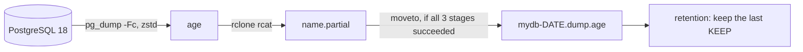

<div align="center">

# 🔐 pgdump-age

**A compressed, encrypted `pg_dump` as a single file on S3. Never touching the disk.**


</div>

## ✨ Why

Your database is tens or hundreds of GB, the host disk is half full, and you want a **logical**, **off-site**, **encrypted** backup that you can restore **even if this tool is gone**.

`pgdump-age` does exactly that and nothing else: one database, one file per day, a simple retention policy.

| | |
|---|---|
| 📦 **One object per backup** | `mydb-20261007T033000Z.dump.age`. No repository, no manifest, no parts to stitch back together |
| 🚫💾 **No local file** | The dump is streamed. The tests run with a read-only container |
| 🔒 **Encrypted with [age](https://github.com/FiloSottile/age)** | Public key on the server, private key with you: the server cannot read its own backups |
| 🛡️ **A truncated dump is never published** | Written as `.partial`, published only if `pg_dump`, `age` and `rclone` all succeeded |
| ♻️ **Safe retention** | Keeps the last `KEEP` dumps, prunes **after** a successful run, never after a failure |
| 🧰 **Restorable without the tool** | `age -d` then `pg_restore`: two standard commands |
| 🐳 **Kamal ready** | One accessory to copy, aliased secrets, validated with Kamal 2.12 |

## 🧭 How it works



```
pg_dump --format=custom --compress=zstd:5  |  age --recipient <public key>  |  rclone rcat  ->  <db>-YYYYMMDDTHHMMSSZ.dump.age
```

One Alpine image (`pg_dump` 18, `age`, `rclone`, `bash`, `tini`), one script (`bin/pgdump-age`), no application dependency.

## 🚀 Quick start

**1. Generate the age key pair** (the private key never leaves your password manager):

```sh
age-keygen -o private-key.txt     # prints the public key age1...
```

**2. Create a read-only role**: see [`examples/kamal/setup.sql`](examples/kamal/setup.sql).

**3. Get the image (or `docker build -t pgdump-age .`) and run a first dump:**

```sh
docker build -t pgdump-age .

docker run --rm --read-only --tmpfs /tmp:size=8m \
  -e PGHOST=db.example.com -e PGUSER=backup -e PGPASSWORD='...' -e PGDATABASE=mydb \
  -e AGE_RECIPIENT=age1... \
  -e S3_ENDPOINT=https://s3.example.com -e S3_REGION=us-east-1 -e S3_BUCKET=my-backups \
  -e S3_ACCESS_KEY_ID='...' -e S3_SECRET_ACCESS_KEY='...' \
  pgdump-age once
```

**4. Check:** `pgdump-age list`, then restore into a throwaway database (see below).

With no command, the container runs `schedule`: one dump per day at `BACKUP_AT` (UTC).

## 🚢 Kamal integration

Everything is in [`examples/kamal/`](examples/kamal):

| File | Purpose |
|---|---|
| [`deploy.pg_backup.yml`](examples/kamal/deploy.pg_backup.yml) | The `accessories:` block to merge into your `deploy.yml` |
| [`secrets.example`](examples/kamal/secrets.example) | The lines to add to `.kamal/secrets` (Bitwarden example) |
| [`setup.sql`](examples/kamal/setup.sql) | The read-only Postgres role |

**Steps:**

1. Generate the age key, create the `backup` role, create the bucket and an S3 user dedicated to that bucket.
2. Create the 3 secrets (`BACKUP_DB_PASSWORD`, `BACKUP_S3_ACCESS_KEY_ID`, `BACKUP_S3_SECRET_ACCESS_KEY`) **before** editing `.kamal/secrets`: a missing item makes every Kamal command for that destination fail, `kamal deploy` included.
3. Merge `deploy.pg_backup.yml` into your config, then fill in the image, host, database, bucket and public key.
4. Boot it, then force a first run without waiting for `BACKUP_AT`:

```sh
bin/kamal accessory boot pg_backup
bin/kamal accessory logs pg_backup
bin/kamal accessory exec pg_backup --reuse "pgdump-age once"
bin/kamal accessory exec pg_backup --reuse "pgdump-age list"
```

The example was validated by rendering the real `docker run` command with Kamal 2.12: `--read-only`, `--tmpfs /tmp:size=8m`, `--restart unless-stopped`, and aliased secrets (`PGPASSWORD` comes from `BACKUP_DB_PASSWORD`). It has **not** been deployed to a real server.

### 📦 Publishing the image

A `vX.Y.Z` tag triggers [`.github/workflows/image.yml`](.github/workflows/image.yml): end-to-end tests, then publication to `ghcr.io/pmakerhq/pgdump-age:vX.Y.Z` (OCI labels `source`, `version`, `revision` included). There is no `latest` tag: pin a version.

```sh
docker pull ghcr.io/pmakerhq/pgdump-age:v0.1.0
```

The digest is written to the run summary: copy it into the accessory image (`image: ...:v0.1.0@sha256:...`). For hosts to pull the image without `docker login`, make the package public. This workflow has not run yet.

To cut a release, run the `/release` skill in Claude Code ([`.claude/skills/release/SKILL.md`](.claude/skills/release/SKILL.md)). It checks that `main` is clean and pushed, proposes the next version from the conventional commits, asks for confirmation, then creates and pushes the annotated tag. Without Claude: `git tag -a vX.Y.Z -m vX.Y.Z && git push origin vX.Y.Z` from an up-to-date `main`.

## ⚙️ Configuration

| Variable | Purpose |
|---|---|
| `PGHOST`, `PGUSER`, `PGPASSWORD`, `PGDATABASE` | Connection. Read-only role, direct connection (no PgBouncer). `PGPORT` is optional |
| `AGE_RECIPIENT` | age public key (`age1...`) |
| `S3_ENDPOINT`, `S3_REGION`, `S3_BUCKET`, `S3_ACCESS_KEY_ID`, `S3_SECRET_ACCESS_KEY` | Destination. The region is required: OVH checks it in the request signature (for example `sbg`). `S3_PREFIX` is optional |
| `S3_PROVIDER` | rclone provider (default `Other`). `OVHcloud` exists in rclone 1.72: **never tried** |
| `KEEP` | Dumps to keep (default `3`) |
| `BACKUP_AT` | Daily run time, `HH:MM` UTC (default `03:30`) |
| `RUN_ON_START` | `1` runs a dump when the container starts. **Avoid it with an automatic restart policy**: every restart takes a full dump and pushes older ones out of the `KEEP` window. For a first run, use `pgdump-age once` |
| `PG_COMPRESS` | `pg_dump` compression (default `zstd:5`) |
| `MULTIPART_MAX_AGE` | Age after which an abandoned upload is cleaned up (default `24h`) |
| `RCLONE_S3_CHUNK_SIZE`, `RCLONE_S3_UPLOAD_CONCURRENCY` | Upload parts (default `32M` x 2, about 312 GiB maximum per object) |

The database name may only contain `[A-Za-z0-9_-]`. **One database per container.** Without `S3_PREFIX`, the cleanup of abandoned uploads covers the whole bucket: use a dedicated bucket or a prefix.

Commands: `pgdump-age schedule` (default), `once`, `list`, `get latest > dump.age`.

Log lines are prefixed `INFO`, `WARN` or `ERROR` (the messages themselves are in French, without accents). Alert on `ERROR`.

## 🔓 Restoring, without this tool

```sh
age -d -i private-key.txt dump.age | pg_restore -d mydb --no-owner
```

- The dump is a `pg_dump` archive version 1.16: you need **`pg_restore` 17 or newer** (16 refuses to read it, verified), preferably 18.
- This pipe is single-process. For a large database, decrypt to a file first (this needs disk space on the restore machine), then restore in parallel:

```sh
age -d -i private-key.txt dump.age > db.dump
pg_restore -j 4 -d mydb --no-owner db.dump
```

## 🧪 Reliability: what is tested

`bash test/run.sh` (Docker required, about 2 minutes) runs Postgres 18 and a fake S3 server, with the container **read-only**. 11 cases:

- ✅ 4 runs leave exactly the 3 most recent dumps
- ✅ full restore through `age` then `pg_restore`
- ✅ connection failure with `KEEP=1`: nothing deleted, nothing published
- ✅ `pg_dump` failing, or **killed mid-stream**: nothing published
- ✅ `.partial` cleanup limited to the database, the prefix and the age
- ✅ `S3_PREFIX` honored
- ✅ `schedule` mode with a failing `moveto`: logged as `ERROR`, never as a success, nothing published
- ✅ `docker stop` during an upload: stops in 1 s, exit code 0
- ✅ orphaned multipart upload cleaned up on the next run
- ✅ an 86 MB dump through multipart upload and multipart copy on rename, 1.5 million rows restored

The critical safeguards were checked by mutation: reintroducing the bug in a copy makes the expected test fail.

## ⚠️ Before production: validate against OVH

The tests run against a fake S3 server, **not against OVH Object Storage**. Two behaviors remain to be verified before relying on the tool for a large database:

1. **The final rename (`rclone moveto`) is a server-side copy**, hence a second full write of the object. Above 4.6 GiB, rclone uses a multipart copy (`UploadPartCopy`). If OVH does not support it or makes it very slow, a dump of tens of GB would fail at this step after hours of dumping, leaving the `.partial` behind. Test a real rename of more than 5 GiB:
   ```sh
   head -c 6G /dev/urandom | rclone rcat ovh:bucket/test.partial
   time rclone moveto ovh:bucket/test.partial ovh:bucket/test.bin
   ```
2. **Cleanup of abandoned uploads** (`rclone backend cleanup`) assumes the provider lists in-progress uploads. Check: `rclone backend list-multipart-uploads ovh:bucket`.

Other known limits: no failure notification (watch the `ERROR` logs and the exit code), no real 121 GB dump measured, a run killed mid-upload leaves invisible parts that are cleaned up by the next run.

## ❓ FAQ

**Why not restic (or kamal-backup)?** Restic writes a repository of encrypted packs, not a single file: you cannot simply download the dump, you need restic and its password. Here, one S3 object is one dump.

**Why age rather than GPG?** No keyring to import (so it works with a read-only container), a one-line public key, no trust model to configure, and a truncated file makes `age -d` fail (exit code 1, verified, even with 10 bytes missing), after it has emitted the chunks it already authenticated. GPG remains the right choice if you already have key infrastructure, signatures or revocation. GPG was not tested in this pipeline.

**Why is a file on disk ruled out?** A 100 GB dump on a half-full disk is an incident waiting to happen. Streaming needs only a few tens of MB of memory.

**What happens if `pg_dump` crashes midway?** `age` and `rclone` finish the truncated stream normally, which is why all three pipeline statuses are checked. The file stays under `.partial`, it is deleted, and existing dumps are untouched.

**What about several databases?** One container per database. This is deliberate: one failure does not block the others, and retention stays readable.

## 🤝 Contributing

Contributions are welcome. Read [`CONTRIBUTING.md`](CONTRIBUTING.md): how to run the tests, the invariants to respect (no file on disk, explicit error checks) and what the project deliberately refuses.

## 🔒 Security

See [`SECURITY.md`](SECURITY.md) to report a vulnerability without exposing it publicly.

## 📄 License

[MIT](LICENSE).
