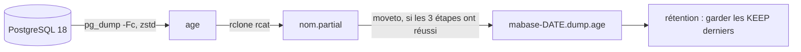

<div align="center">

# 🔐 pg-backup

**Un `pg_dump` compressé et chiffré, en un seul fichier sur S3. Sans jamais écrire sur le disque.**


<!-- Une fois le dépôt publié, ajouter le badge CI :
 -->

</div>

## ✨ Pourquoi

Votre base fait des dizaines ou des centaines de Go, le disque de l'hôte est à moitié plein, et vous voulez une sauvegarde logique **hors site**, **chiffrée**, que vous pouvez restaurer **même si cet outil a disparu**.

`pg-backup` fait exactement ça, et rien d'autre : une base, un fichier par jour, une rétention simple.

| | |
|---|---|
| 📦 **Un seul objet par sauvegarde** | `mabase-20261007T033000Z.dump.age`. Pas de dépôt, pas de manifest, pas de parts à recoller |
| 🚫💾 **Aucun fichier local** | Le dump part en flux. Les tests tournent avec un conteneur en lecture seule |
| 🔒 **Chiffré avec [age](https://github.com/FiloSottile/age)** | Clé publique sur le serveur, clé privée chez vous : le serveur ne peut pas lire ses propres sauvegardes |
| 🛡️ **Jamais de dump tronqué publié** | Écriture en `.partial`, publication seulement si `pg_dump`, `age` et `rclone` ont tous réussi |
| ♻️ **Rétention sûre** | Garde les `KEEP` derniers dumps, supprime **après** un run réussi, jamais après un échec |
| 🧰 **Restaurable sans l'outil** | `age -d` puis `pg_restore`, deux commandes standard |
| 🐳 **Prêt pour Kamal** | Un accessory à copier, des secrets aliasés, validé avec Kamal 2.12 |

## 🧭 Comment ça marche



```
pg_dump --format=custom --compress=zstd:5  |  age --recipient <clé publique>  |  rclone rcat  ->  <base>-AAAAMMJJTHHMMSSZ.dump.age
```

Une image Alpine (`pg_dump` 18, `age`, `rclone`, `bash`, `tini`), un script (`bin/pg-backup`), aucune dépendance applicative.

## 🚀 Démarrage rapide

**1. Générer la paire de clés age** (la clé privée ne quitte jamais votre gestionnaire de mots de passe) :

```sh
age-keygen -o cle-privee.txt     # affiche la clé publique age1...
```

**2. Créer un rôle en lecture seule** : voir [`examples/kamal/setup.sql`](examples/kamal/setup.sql).

**3. Construire l'image et lancer un premier dump :**

```sh
docker build -t pg-backup .

docker run --rm --read-only --tmpfs /tmp:size=8m \
  -e PGHOST=db.example.com -e PGUSER=backup -e PGPASSWORD='...' -e PGDATABASE=mabase \
  -e AGE_RECIPIENT=age1... \
  -e S3_ENDPOINT=https://s3.example.com -e S3_REGION=us-east-1 -e S3_BUCKET=mes-backups \
  -e S3_ACCESS_KEY_ID='...' -e S3_SECRET_ACCESS_KEY='...' \
  pg-backup once
```

**4. Vérifier :** `pg-backup list`, puis restaurer dans une base jetable (voir plus bas).

Sans commande, le conteneur lance `schedule` : un dump par jour à `BACKUP_AT` (UTC).

## 🚢 Intégration Kamal

Tout est dans [`examples/kamal/`](examples/kamal) :

| Fichier | Rôle |
|---|---|
| [`deploy.pg_backup.yml`](examples/kamal/deploy.pg_backup.yml) | Le bloc `accessories:` à fusionner dans votre `deploy.yml` |
| [`secrets.example`](examples/kamal/secrets.example) | Les lignes à ajouter à `.kamal/secrets` (exemple Bitwarden) |
| [`setup.sql`](examples/kamal/setup.sql) | Le rôle Postgres en lecture seule |

**Étapes :**

1. Générer la clé age, créer le rôle `backup`, créer le bucket et un utilisateur S3 dédié à ce bucket.
2. Créer les 3 secrets (`BACKUP_DB_PASSWORD`, `BACKUP_S3_ACCESS_KEY_ID`, `BACKUP_S3_SECRET_ACCESS_KEY`) **avant** de modifier `.kamal/secrets` : un item manquant fait échouer toute commande Kamal de la destination, `kamal deploy` compris.
3. Fusionner `deploy.pg_backup.yml` dans votre config, puis renseigner l'image, l'hôte, la base, le bucket et la clé publique.
4. Démarrer, puis forcer un premier run sans attendre `BACKUP_AT` :

```sh
bin/kamal accessory boot pg_backup
bin/kamal accessory logs pg_backup
bin/kamal accessory exec pg_backup --reuse "pg-backup once"
bin/kamal accessory exec pg_backup --reuse "pg-backup list"
```

L'exemple a été validé en rendant la vraie commande `docker run` avec Kamal 2.12 : `--read-only`, `--tmpfs /tmp:size=8m`, `--restart unless-stopped`, et les secrets aliasés (`PGPASSWORD` vient de `BACKUP_DB_PASSWORD`). Il n'a **pas** été déployé sur un vrai serveur.

### 📦 Publier l'image

Un tag `vX.Y.Z` déclenche [`.github/workflows/image.yml`](.github/workflows/image.yml) : tests de bout en bout, puis publication sur `ghcr.io/<propriétaire>/<dépôt>`. Le digest est écrit dans le résumé du run : copiez-le dans l'image de l'accessory (`image: ...:v0.1.0@sha256:...`). Pour que les hôtes puissent tirer l'image sans `docker login`, rendez le paquet public. Ce workflow n'a pas encore tourné.

## ⚙️ Configuration

| Variable | Rôle |
|---|---|
| `PGHOST`, `PGUSER`, `PGPASSWORD`, `PGDATABASE` | Connexion. Rôle en lecture seule, connexion directe (pas de PgBouncer). `PGPORT` optionnel |
| `AGE_RECIPIENT` | Clé publique age (`age1...`) |
| `S3_ENDPOINT`, `S3_REGION`, `S3_BUCKET`, `S3_ACCESS_KEY_ID`, `S3_SECRET_ACCESS_KEY` | Destination. La région est obligatoire : OVH la vérifie dans la signature (par exemple `sbg`). `S3_PREFIX` optionnel |
| `S3_PROVIDER` | Provider rclone (défaut `Other`). `OVHcloud` existe dans rclone 1.72 : **jamais essayé** |
| `KEEP` | Dumps conservés (défaut `3`) |
| `BACKUP_AT` | Heure du run quotidien, `HH:MM` UTC (défaut `03:30`) |
| `RUN_ON_START` | `1` pour lancer un dump au démarrage. **À éviter avec un redémarrage automatique** : chaque redémarrage prend un dump complet et repousse les anciens hors des `KEEP` conservés. Pour un premier run, utiliser `pg-backup once` |
| `PG_COMPRESS` | Compression de `pg_dump` (défaut `zstd:5`) |
| `MULTIPART_MAX_AGE` | Âge à partir duquel un upload abandonné est nettoyé (défaut `24h`) |
| `RCLONE_S3_CHUNK_SIZE`, `RCLONE_S3_UPLOAD_CONCURRENCY` | Parts de l'upload (défaut `32M` x 2, plafond d'environ 312 Gio par objet) |

Le nom de base ne peut contenir que `[A-Za-z0-9_-]`. **Une base par conteneur.** Sans `S3_PREFIX`, le nettoyage des uploads abandonnés couvre tout le bucket : utilisez un bucket dédié ou un préfixe.

Commandes : `pg-backup schedule` (défaut), `once`, `list`, `get latest > dump.age`.

## 🔓 Restaurer, sans cet outil

```sh
age -d -i cle-privee.txt dump.age | pg_restore -d mabase --no-owner
```

- Le dump est une archive `pg_dump` 1.16 : il faut **`pg_restore` 17 ou plus** (la 16 refuse de le lire, vérifié), de préférence 18.
- Ce pipe est mono-processus. Pour une grosse base, déchiffrez d'abord dans un fichier (l'espace disque est alors nécessaire sur la machine de restauration), puis restaurez en parallèle :

```sh
age -d -i cle-privee.txt dump.age > base.dump
pg_restore -j 4 -d mabase --no-owner base.dump
```

## 🧪 Fiabilité : ce qui est testé

`bash test/run.sh` (Docker requis, environ 2 minutes) lance Postgres 18 et un S3 factice, avec le conteneur en **lecture seule**. 11 cas :

- ✅ 4 runs donnent exactement les 3 dumps les plus récents
- ✅ restauration complète via `age` puis `pg_restore`
- ✅ échec de connexion avec `KEEP=1` : rien supprimé, rien publié
- ✅ `pg_dump` en échec, ou **tué en cours de flux** : rien publié
- ✅ nettoyage des `.partial` limité à la base, au préfixe et à l'âge
- ✅ `S3_PREFIX` respecté
- ✅ mode `schedule` avec un `moveto` en échec : `ERROR`, jamais `termine`, rien publié
- ✅ `docker stop` pendant un upload : arrêt en 1 s, code 0
- ✅ upload multipart orphelin nettoyé au run suivant
- ✅ gros dump de 86 Mo en multipart, copie multipart au renommage, 1,5 million de lignes restaurées

Les garde-fous critiques ont été vérifiés par mutation : réintroduire le bug dans une copie fait échouer le test attendu.

## ⚠️ Avant la production : valider contre OVH

Les tests tournent contre un serveur S3 factice, **pas contre OVH Object Storage**. Deux comportements restent à vérifier avant de compter sur l'outil pour une grosse base :

1. **Le renommage final (`rclone moveto`) est une copie côté serveur**, donc une seconde écriture complète de l'objet. Au-delà de 4,6 Gio, rclone utilise une copie multipart (`UploadPartCopy`). Si OVH ne la supporte pas ou la rend très lente, un dump de dizaines de Go échouerait à cette étape après des heures de dump, en laissant le `.partial`. Testez un renommage réel de plus de 5 Gio :
   ```sh
   head -c 6G /dev/urandom | rclone rcat ovh:bucket/test.partial
   time rclone moveto ovh:bucket/test.partial ovh:bucket/test.bin
   ```
2. **Le nettoyage des uploads abandonnés** (`rclone backend cleanup`) suppose que le fournisseur liste les uploads en cours. Vérifiez : `rclone backend list-multipart-uploads ovh:bucket`.

Autres limites connues : pas de notification d'échec (surveillez les logs `ERROR` et le code de sortie), aucun dump de 121 Go réellement mesuré, un run tué en plein upload laisse des parts invisibles nettoyées au run suivant.

## ❓ FAQ

**Pourquoi pas restic (ou kamal-backup) ?** Restic écrit un dépôt de packs chiffrés, pas un fichier unique : on ne peut pas simplement télécharger le dump, il faut restic et son mot de passe. Ici, un objet S3 = un dump.

**Pourquoi age plutôt que GPG ?** Pas de trousseau à importer (donc compatible avec un conteneur en lecture seule), une clé publique d'une ligne, pas de modèle de confiance à configurer, et un fichier tronqué fait échouer `age -d` (code de sortie 1, vérifié, même avec 10 octets manquants), après avoir émis les blocs déjà authentifiés. GPG reste le bon choix si vous avez déjà une infrastructure de clés, des signatures ou de la révocation. Je n'ai pas testé GPG dans ce pipeline.

**Pourquoi un fichier sur disque est-il exclu ?** Un dump de 100 Go sur un disque à moitié plein est un incident en attente. Le flux n'a besoin que de quelques dizaines de Mo de mémoire.

**Que se passe-t-il si `pg_dump` plante en route ?** `age` et `rclone` terminent normalement le flux tronqué, c'est pourquoi les trois statuts du pipeline sont contrôlés. Le fichier reste sous `.partial`, il est supprimé, et les dumps existants ne sont pas touchés.

**Et plusieurs bases ?** Un conteneur par base. C'est volontaire : un échec ne bloque pas les autres, et la rétention reste lisible.

## 🤝 Contribuer

Les contributions sont bienvenues. Lisez [`CONTRIBUTING.md`](CONTRIBUTING.md) : comment lancer les tests, les invariants à respecter (aucun fichier sur disque, vérifications explicites des erreurs) et ce que le projet refuse volontairement.

## 🔒 Sécurité

Voir [`SECURITY.md`](SECURITY.md) pour signaler une vulnérabilité sans l'exposer publiquement.
